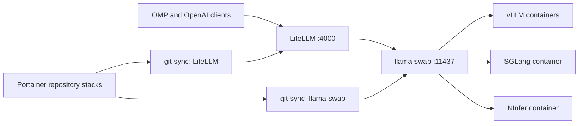
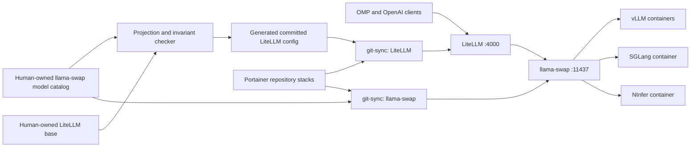

::: {.brief-meta}
**Question.** Which tool supports an effective human–LLM review loop?
**Decision.** Select an architecture-board trial or retain a Mermaid workflow, based on verified inspect, edit, and comment capabilities.
**Reader.** self.
:::

## Summary

Trial **Miro** first when hosted-board exposure is acceptable; otherwise retain [**Mermaid**](#glossary-mermaid) in Git [@miro-faq; @mermaid-usage; @mermaid-cli].

- **Workflows:** Miro covers inspect, edit, and comments; Mermaid needs Git or Crit for feedback and approval [@miro-tools; @mermaid-usage; @crit-plans].
- **Evidence:** first-party docs verify interfaces and access, not output quality or local-model reliability [@miro-faq; @mermaid-cli].
- **Corrections:** Miro is moving from `layout_*` to `canvas_*`; Whimsical now documents comments; Figma server access is broader than existing-file write permission [@miro-changelog; @whimsical-tools; @figma-guide; @figma-write].
- **Tradeoff:** Miro preserves spatial review context; Mermaid preserves local, diffable source [@miro-tools; @mermaid-cli].
- **Next check:** on one authorized frame, prove stable IDs and correct comment attachment, then stop before update [@miro-tools; @miro-faq].

## Glossary

### MCP {#glossary-mcp}

The Model Context Protocol connects an AI client to tools and resources; MCP Apps add sandboxed interactive HTML resources and bidirectional messages where the host supports the extension [@mcp-apps].

### Structured board read {#glossary-structured-read}

A structured board read returns object data that an agent can address again. Miro's current SVG read includes stable `data-miro-id` values for that purpose [@miro-tools].

### Mermaid {#glossary-mermaid}

Mermaid is a text syntax that a JavaScript renderer or CLI turns into diagrams such as flowcharts and architecture views [@mermaid-usage; @mermaid-flowchart; @mermaid-architecture; @mermaid-cli].

### Review gate {#glossary-review-gate}

A review gate separates an agent's proposal from an accepted edit. Crit implements this with inline comments or suggestions, a structured prompt back to the agent, and a visible next-round diff [@crit-plans].

## The loop needs an inspectable artifact and an explicit gate

A useful loop needs bounded inspection, durable identity, a complete proposal, attached feedback, approval-gated mutation, and a final reread.

| Step | Miro board | Mermaid in Git |
|---|---|---|
| Inspect | Search, then read a narrow SVG with stable IDs [@miro-tools]. | Read `.mmd`; render SVG, PNG, or PDF [@mermaid-cli]. |
| Propose | Return a patch without calling update. This is a proposed protocol [@miro-changelog]. | Return a text diff; Crit can render Mermaid and collect feedback [@crit-plans]. |
| Comment | List, reply to, and resolve board comments [@miro-tools]. | Git or Crit owns comments [@mermaid-usage; @crit-plans]. |
| Apply | Update from SVG, then reread the frame [@miro-tools]. | Apply the accepted patch, render, and review the final diff [@mermaid-cli]. |

Miro keeps discussion beside board objects; Mermaid keeps the artifact as text. Both need an external [review gate](#glossary-review-gate) [@miro-tools; @mermaid-usage; @crit-plans].

## Current tools expose different parts of the loop

Current primary sources separate complete review surfaces from artifact tools and custom kits.

| Tool | Verified surface | Fit |
|---|---|---|
| **Miro** | Search; SVG create, read, and update; stable IDs; comment list, reply, and resolve [@miro-tools; @miro-usecases]. | Best single-board loop. OAuth follows board permissions and selects one team [@miro-faq; @miro-setup]. |
| **Whimsical** | Remote object operations and full comment lifecycle; desktop MCP acts on the open file [@whimsical-tools; @whimsical-mcp]. | Strong fallback, although remote mode is hosted and desktop enablement requires support [@whimsical-mcp]. Free permits up to 50 new board objects per month; Pro removes that cap [@whimsical-pricing]. |
| **Lucid** | Create, edit, search, export, and comments; separate read-only endpoint [@lucid-mcp]. | Good read-only surface; generated diagrams are static [@lucid-mcp]. |
| **Figma/FigJam** | Native-object writes plus FigJam shapes, connectors, sections, and tables [@figma-guide; @figma-skills]. | Existing-file writes need a Full seat and edit permission; read calls have seat- and plan-specific limits [@figma-write; @figma-limits]. |
| **Eraser** | Diagram generation and edit, CRUD, search, and image export [@eraser-mcp]. | Strong architecture artifact, with no documented board-comment calls [@eraser-mcp]. Self-hosting and single tenancy are Enterprise-only options [@eraser-security]. |
| **draw.io** | Hosted or local MCP; plugins write local `.drawio` files [@drawio-mcp]. | Strongest verified local-file path [@drawio-mcp]. |
| **tldraw** | MCP App create/edit/delete; Starter Kit shapes, screenshots, history, and custom modes [@tldraw-mcp; @tldraw-agent]. | Best custom-loop base, but production sync needs storage, auth, limits, and snapshots [@tldraw-sync]. The SDK offers a free hobby license and a 100-day trial; production use needs a commercial license [@tldraw-pricing]. |
| **Penpot** | Local focused-page inspect and edit; remote server for a Penpot domain [@penpot-mcp]. | Self-hostable, with no documented MCP comment queue [@penpot-mcp]. |
| **IcePanel** | Reads architecture models and diagrams; writes objects, connections, and ADRs [@icepanel-mcp]. | Diagram create, drafts, versions, and comments are unsupported [@icepanel-mcp]. |
| **Excalidraw** | Remote, local, or self-deployed interactive MCP App [@excalidraw-mcp; @mcp-apps]. | Sketch surface without a documented persistent review protocol [@excalidraw-mcp]. |

Napkin documents asynchronous generation and download [@napkin-api]. Structurizr documents AI-produced DSL followed by manual paste [@structurizr-ai]. Neither source establishes an inspect-comment-approve loop.

Miro Sidekicks can use selected board objects as prompt context and create diagram formats, but the feature's documentation does not establish an approval-gated MCP write [@miro-sidekicks].

## Current documentation changes the old comparison

Five source conclusions changed or became more precise:

- Miro's `canvas_*` tools replace `layout_*`; reads should stay frame-scoped [@miro-changelog].
- Whimsical now documents object edits and comment create, reply, edit, resolve, reopen, and delete [@whimsical-tools].
- Figma's remote server spans seats and plans, but existing-file writes still require a Full seat and edit access [@figma-guide; @figma-write].
- Eraser Free now says three files and three AI diagrams. Starter lists $15 per member per month billed annually or $20 monthly [@eraser-pricing].
- tldraw now has a quick MCP App, while a durable custom review mode still needs the Starter Kit and production infrastructure [@tldraw-mcp; @tldraw-agent; @tldraw-sync].

Miro counts every MCP call. Daily limits are 100 on Free, 500 on Starter, 2,000 on Business, and 10,000 on Enterprise, resetting at 00:00 UTC [@miro-limits; @miro-pricing]. Narrow cycles protect context and quota [@miro-changelog; @miro-limits].

## Miro buys review fidelity at privacy and operating cost

| Criterion | Miro | Mermaid | Local draw.io or tldraw |
|---|---|---|---|
| Review | Stable IDs and board comments [@miro-tools]. | Source diff; spatial feedback becomes text [@crit-plans]. | Native canvas; no documented draw.io comment protocol [@drawio-mcp]. |
| Ownership | Hosted board [@miro-faq]. | Repository source [@mermaid-cli]. | Local `.drawio`; tldraw needs an app and storage design [@drawio-mcp; @tldraw-sync]. |
| Privacy | Authorized content reaches Miro [@miro-faq]. | Local source and rendering need no board SaaS [@mermaid-usage; @mermaid-cli]. | draw.io documents modes where data stays local [@drawio-mcp]. |
| Burden | OAuth, permissions, team selection, quotas [@miro-setup; @miro-limits]. | File, renderer, existing Git review. | draw.io is light; production tldraw adds storage and controls [@tldraw-sync]. |

Use Miro only when hosted-board exposure is acceptable; keep Mermaid as the private default [@miro-faq; @mermaid-usage; @mermaid-cli]. See [Private inference access](../private-inference-access/index.qmd) for the separate model path.

## A read-only trial can settle the choice

Use an existing connection and authorized frame. Do not create or update anything.

1. Locate one frame with `canvas_search`; read it with `canvas_read_as_svg` [@miro-tools].
2. Record whether every review subject has a stable `data-miro-id` [@miro-tools].
3. List open comments and verify their subjects [@miro-tools].
4. Request a prose change set keyed by ID; reject any update call.
5. Compare it with a complete Mermaid diff.

Choose Miro if identity and comments survive the read and the hosted boundary is acceptable. Otherwise retain Mermaid. Without an authorized frame, stop at source review rather than create external state.

## Worked example

No Miro account, board, MCP session, or local model was used for this briefing. The example therefore combines an actual dated homelab diagram with a source-supported, **unexecuted** Miro path. It does not invent tool output.

The documented input is the inference control plane as recorded on 2026-09-08 [@localWhiteboardEvidence]. Its complete Mermaid source is:

The proposed review asks one concrete question: **Where should the planned static contract gate and generated LiteLLM model projection appear?** The control-plane source describes llama-swap configuration as the human-owned model catalog, a human-owned LiteLLM base, a checker/generator, and a committed generated LiteLLM configuration [@localWhiteboardEvidence]. See [Inference control plane](../inference-control-plane/index.qmd) for that decision.

A Miro run would search for the frame, read its SVG, and return a proposal keyed to the returned object IDs. After a human `REVISE` or `ACCEPT`, it would call `canvas_update_from_svg`, reread the same frame, reply to the review comment, and resolve it only after confirmation [@miro-tools]. Those calls were not made, so no Miro SVG, IDs, comment transcript, or final board exists to reproduce.

The equivalent Mermaid edit can be shown completely as a **proposed source artifact**, without claiming execution:

A local renderer can turn saved Mermaid source into SVG with `mmdc -i input.mmd -o output.svg` [@mermaid-cli]. This briefing did not run that command. The example proves that the Git path can represent the full proposed change; it cannot compare visual cleanup effort, comment attachment, tool-call reliability, or Miro's final board state.

## Limitations

Primary docs establish interfaces, not clean layouts, safe object preservation, no-write obedience, or local-model tool reliability. No board output, latency, call count, transcript, or cross-client behavior was measured. Hosted vendors' docs cannot prove privacy beyond their stated boundaries.

The dated control-plane diagram records repository evidence only. Portainer state was not inspected [@localWhiteboardEvidence].

## Next action

Run the five-step read-only Miro frame check only if an authorized board already exists. Capture returned IDs and comment attachment without calling any mutation tool. If that evidence is clean, schedule one approval-gated Miro update. Otherwise retain Mermaid in Git and evaluate local draw.io only when spatial editing becomes the dominant cost.

## References

::: {#refs}
:::
