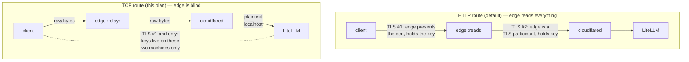

# LiteLLM over Cloudflare Tunnel — Opaque-Privacy Plan

Status: planned, not implemented
Date: 2026-08-28

## TL;DR

A default (HTTP/L7) tunnel route lets Cloudflare's edge read **everything** — prompts,
completions, `Authorization` headers — because the edge is a TLS endpoint on both legs of
the path. This plan exposes LiteLLM through a tunnel **TCP (L4) route** instead, with TLS
terminated **inside LiteLLM** using a local CA. The Cloudflare edge then relays opaque
bytes it cannot decrypt; the only TLS handshake in the path is client ↔ LiteLLM.

Decision: **tunnel TCP route + LiteLLM-native TLS + client-side `cloudflared access tcp`**
over Tailscale, because we also want Cloudflare's edge (Access/SSO, DDoS, no inbound
ports, multi-client without VPN membership). Tailscale remains the fallback if this
turns out to be more friction than expected — see [Alternative](#alternative-tailscale).

## Why the L7 route is not private

TLS session keys exist only on the two machines that completed a handshake. A relay that
never joined a handshake holds no key and cannot decrypt. So the question is always:
*is the Cloudflare edge a TLS endpoint on the traffic path?*



Evidence the edge reads plaintext in L7 mode:

- Official Data Localization docs: "Cloudflare performs TLS termination (decrypts HTTPS)
  in data centers globally by default, allowing Cloudflare to inspect traffic… End-user
  requests are decrypted at the data center, then inspected."
  <https://developers.cloudflare.com/data-localization/regional-services/http-requests/>
- [cloudflared#1654](https://github.com/cloudflare/cloudflared/issues/1654) proposes
  "Blind TLS pass-through" as a **new feature** — it exists because today's HTTP routing
  is not blind.
- Cloudflare community answers confirm the edge "can decrypt traffic… operators and
  systems can see the plaintext as it passes through the edge."

In L4 (TCP route) mode the edge sees: client IP, timing, byte counts, and the cleartext
`ClientHello` (SNI). Prompt, completion, and Bearer token are post-handshake ciphertext.
Nothing more, and it's structural — not a policy promise.

## Current state (what this modifies)

| Stack | File | Notes |
|---|---|---|
| `litellm` | `services/litellm/docker-compose.yml` | Portainer CE + git-sync; litellm:4000 on custom network `litellm`; postgres + valkey; master/salt/postgres/llama-swap keys via Portainer env vars; port 4000 published to all interfaces |
| `cloudflared` | `services/cloudflared/docker-compose.yml` | Token-based (remote-managed) tunnel, external network `cloudflare_tunnel` |

Accepted caveats (do not revisit):

1. llama-swap/vLLM is **never** exposed — only reachable from LiteLLM over the internal
   docker network. No gRPC port, no published ports, egress firewalled.
2. LiteLLM master key stays in Portainer env vars, never committed.
3. One virtual key per client/device for attribution and scoped rotation.

## Implementation

### 1. Local CA + server cert (inference host)

Let's Encrypt won't issue for loopback, and the client's SNI will be `localhost`/
`127.0.0.1` (the client app talks to a local port opened by `cloudflared access tcp`,
not to the public hostname). So: tiny local CA, pinned on each client.

Store in `/mnt/models/litellm/tls/` (matches existing `/mnt/models/litellm/*` layout):

```sh
mkdir -p /mnt/models/litellm/tls && cd /mnt/models/litellm/tls

# CA — do once
openssl ecparam -name prime256v1 -genkey -noout -out ca.key
openssl req -new -x509 -key ca.key -subj "/CN=llm-local-ca" -days 3650 -out ca.pem

# Server cert — SANs cover hostname, localhost, and loopback
openssl ecparam -name prime256v1 -genkey -noout -out llm.key
openssl req -new -key llm.key -subj "/CN=llm.example.com" \
  -addext "subjectAltName=DNS:llm.example.com,DNS:localhost,IP:127.0.0.1" -out llm.csr
openssl x509 -req -in llm.csr -CA ca.pem -CAkey ca.key -CAcreateserial \
  -days 825 -copy_extensions copyall -out llm.crt

chmod 600 ca.key llm.key
```

Substitute the real hostname (`llm.<your-domain>`) for `llm.example.com` in the CSR.
Never commit `ca.key`/`llm.key` (git-sync repo). `ca.pem` is copied to each client.

### 2. LiteLLM: terminate TLS natively

LiteLLM serves TLS directly (`--ssl_keyfile_path` / `--ssl_certfile_path`, or the
`SSL_KEYFILE_PATH` / `SSL_CERTFILE_PATH` env vars — <https://docs.litellm.ai/docs/proxy/cli>).
No nginx/caddy sidecar needed.

`services/litellm/docker-compose.yml`, `litellm` service:

```yaml
    environment:
      # ... existing ...
      SSL_KEYFILE_PATH: /tls/llm.key
      SSL_CERTFILE_PATH: /tls/llm.crt
    ports:
      - "127.0.0.1:4000:4000"   # was "4000:4000" — loopback only; drop entirely if cloudflared is the sole consumer
    volumes:
      - litellm-config:/config:ro
      - /mnt/models/litellm/tls:/tls:ro
    healthcheck:
      # health endpoint is now HTTPS
      test: ["CMD", "python", "-c", "import urllib.request,ssl; urllib.request.urlopen('https://127.0.0.1:4000/health/liveliness', context=ssl._create_unverified_context()).read()"]
```

(No `env_file` — per repo convention, Portainer-stack vars stay explicit `${VAR}` /
plain values set in the Portainer UI where secret.)

### 3. cloudflared: join the litellm network

`services/cloudflared/docker-compose.yml`:

```yaml
    networks:
      - cloudflare_tunnel
      - litellm

networks:
  cloudflare_tunnel:
    external: true
  litellm:
    external: true
```

### 4. Tunnel route (dashboard — tunnel is token-managed)

Cloudflare dashboard → Networks → Tunnels → `<tunnel>` → Routes → Add route:

- Hostname: `llm.<your-domain>`
- Service type: **TCP**
- Service: `tcp://litellm:4000`

This creates the CNAME `llm.<your-domain>` → `<UUID>.cfargotunnel.com` automatically.
Any plan — no Spectrum/Enterprise add-on (that's only for direct public TCP/UDP apps).

### 5. Access app + policy

Dashboard → Access → Applications → Add self-hosted application:

- Application domain: `llm.<your-domain>`
- Policy: allow your SSO account(s) (optionally + device posture / mTLS cert)

Without this, the TCP route is a public pipe — the only thing standing between
anyone on the internet and LiteLLM would be the API key. Access rejects
unauthenticated connections at the edge before a byte reaches the box.

### 6. Client side (each laptop)

Install `cloudflared` (single binary). One command per device:

```sh
cloudflared access tcp --hostname llm.<your-domain> --url localhost:9210
```

First run opens a browser for the Access SSO; afterwards the cookie is cached and it's
silent. Opens `127.0.0.1:9210`, outbound-only (needs just 80/443 egress; NAT-safe).
Alias it: `alias llm-tunnel='cloudflared access tcp --hostname llm.<your-domain> --url localhost:9210'`.

App config — note the pinned CA:

```python
import httpx
from openai import OpenAI

client = OpenAI(
    base_url="https://127.0.0.1:9210",
    api_key="sk-litellm-virtual-key-for-this-device",  # one per device, not the master key
    http_client=httpx.Client(verify="/path/to/ca.pem"),
)
```

## What Cloudflare can and can't see

| | L7 HTTP route | **TCP route + our TLS (this plan)** |
|---|---|---|
| Prompts / completions | **yes** | no |
| `Authorization: Bearer sk-…` | **yes** | no |
| SNI, client IP, timing, byte counts | yes | yes (SNI = `localhost` — uninformative) |
| Auth gate | Access (L7, can inspect) | Access (connection-level) |
| WAF / bot mgmt / cache on hostname | yes | **no** (L4 relay — accepted trade) |
| Client software needed | none | `cloudflared` binary |
| Plan required | any | any |

Operational notes:

- Origin never sees real client IPs on TCP routes (sees cloudflared's IP — documented).
  Attribution comes from **per-device virtual keys** in LiteLLM, not IPs. Access =
  "trusted human/device"; virtual key = "which client".
- SSE streaming works — long-lived TCP is what the route is designed for.
- No HTTP request logs/WAF events exist for the hostname (it's L4) — that's part of the
  proof of blindness.

## Verification (do all four)

1. **Handshake terminates on the box, not the edge:** on the client,
   `openssl s_client -connect 127.0.0.1:9210 -servername localhost -CAfile ca.pem`
   → clean verify against `llm-local-ca`, certificate with `DNS:localhost, IP:127.0.0.1` SANs.
2. **Access enforced:** with the client-side `cloudflared access tcp` *not* logged in,
   connections must be refused by the edge.
3. **End-to-end:** one chat completion through the SDK from the laptop; confirm llama-swap
   served it and LiteLLM logs show the virtual key's identity.
4. **No public surface:** from outside, `nc -zv <box-ip> 4000` must refuse (loopback
   publish); the hostname resolves to Cloudflare anycast, not the box.

## Alternative: Tailscale

If client-side `cloudflared` + local CA becomes more friction than it's worth:

- Tailscale on inference box + laptops; point `base_url` at the tailnet IP; LiteLLM serves
  plain HTTPS on loopback/tailnet interface with the same local-CA cert (or plain HTTP on
  the tailnet if you accept WG-encrypted-but-not-TLS).
- E2E WireGuard, keys only you hold, zero Cloudflare in the data path, no client binaries
  beyond the Tailscale app, no SNI/loopback cert weirdness.
- Gives up: Access/SSO policy as an auth layer, Cloudflare DDoS shielding, and
  easy non-member client access.

## Sources

- Tunnel TCP route + `cloudflared access tcp` client:
  <https://developers.cloudflare.com/cloudflare-one/access-controls/applications/non-http/cloudflared-authentication/arbitrary-tcp/>
- Tunnel routing / supported protocols (TCP = L4 relay, any plan):
  <https://developers.cloudflare.com/tunnel/routing/>
- Edge TLS termination / inspection (L7 visibility):
  <https://developers.cloudflare.com/data-localization/regional-services/http-requests/>
- "Blind TLS pass-through" feature request (proof L7 isn't blind today):
  <https://github.com/cloudflare/cloudflared/issues/1654>
- LiteLLM TLS flags: <https://docs.litellm.ai/docs/proxy/cli>,
  <https://docs.litellm.ai/docs/proxy/security_encryption_faq>
- LiteLLM security best practices (master key, virtual keys, private networks):
  <https://docs.litellm.ai/docs/proxy/security_best_practices>
