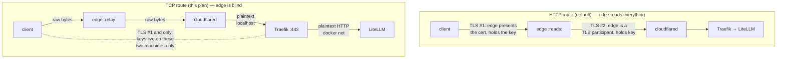

# LiteLLM over Cloudflare Tunnel — Opaque-Privacy Plan

Status: planned, not implemented
Date: 2026-08-28
Amended 2026-08-28: local CA + LiteLLM-native TLS → per-host Traefik + Let's Encrypt
(DNS-01); dashboard tunnel config → Terraform; client dials public hostname over the
local relay port so LE certs validate against the system trust store.

## TL;DR

A default (HTTP/L7) tunnel route lets Cloudflare's edge read **everything** — prompts,
completions, `Authorization` headers — because the edge is a TLS endpoint on both legs of
the path. This plan exposes LiteLLM through a tunnel **TCP (L4) route** instead, with TLS
terminated at a **per-host Traefik** using **Let's Encrypt (DNS-01)**. The client dials
the public hostname over the local `cloudflared access tcp` port (SNI = the real
hostname, so the LE cert validates normally). The Cloudflare edge then relays opaque
bytes it cannot decrypt; the only TLS handshake in the path is client ↔ Traefik.

Decision: **tunnel TCP route + per-host Traefik (LE DNS-01) + client-side
`cloudflared access tcp`** over Tailscale, because we also want Cloudflare's edge
(Access/SSO, DDoS, no inbound ports, multi-client without VPN membership). Tailscale
remains the fallback if this turns out to be more friction than expected — see
[Alternative](#alternative-tailscale).

This plan is the first route of a reusable per-host ingress pattern (one Traefik per
host, Cloudflare side managed in Terraform); the broader multi-host design is tracked
separately.

## Why the L7 route is not private

TLS session keys exist only on the two machines that completed a handshake. A relay that
never joined a handshake holds no key and cannot decrypt. So the question is always:
*is the Cloudflare edge a TLS endpoint on the traffic path?*



Evidence the edge reads plaintext in L7 mode:

- Official Data Localization docs: "Cloudflare performs TLS termination (decrypts HTTPS)
  in data centers globally by default, allowing Cloudflare to inspect traffic… End-user
  requests are decrypted at the data center, then inspected."
  <https://developers.cloudflare.com/data-localization/regional-services/http-requests/>
- [cloudflared#1654](https://github.com/cloudflare/cloudflared/issues/1654) proposes
  "Blind TLS pass-through" as a **new feature** — it exists because today's HTTP routing
  is not blind.
- Cloudflare community answers confirm the edge "can decrypt traffic… operators and
  systems can see the plaintext as it passes through the edge."

In L4 (TCP route) mode the edge sees: client IP, timing, byte counts, and the cleartext
`ClientHello` (SNI). Prompt, completion, and Bearer token are post-handshake ciphertext.
Nothing more, and it's structural — not a policy promise.

## Current state (what this modifies)

| Stack | File | Notes |
|---|---|---|
| `litellm` | `services/litellm/docker-compose.yml` | Portainer CE + git-sync; litellm:4000 on custom network `litellm`; postgres + valkey; master/salt/postgres/llama-swap keys via Portainer env vars; port 4000 published to all interfaces |
| `cloudflared` | `services/cloudflared/docker-compose.yml` | Token-based (remote-managed) tunnel, external network `cloudflare_tunnel` |
| `traefik` | `services/traefik/` (**new**) | Per-host ingress, defined once, deployed to each host that needs it |

Accepted caveats (do not revisit):

1. llama-swap/vLLM is **never** exposed — only reachable from LiteLLM over the internal
   docker network. No gRPC port, no published ports, egress firewalled.
2. LiteLLM master key stays in Portainer env vars, never committed.
3. One virtual key per client/device for attribution and scoped rotation.

## Implementation

### 1. Traefik ingress stack (shared, deployed per host)

New `services/traefik/` — one instance per host, deployed through the existing
git-sync/Portainer flow. Failure domain is per host; LE state (`acme.json`) is per host,
so renewal and host reimages never couple across machines.

```yaml
name: traefik

services:
  socket-proxy:
    container_name: traefik-socket-proxy
    image: tecnick/docker-socket-proxy:latest   # pin at deploy
    restart: unless-stopped
    environment:
      CONTAINERS: 1
      NETWORKS: 1
      EVENTS: 1
    volumes:
      - /var/run/docker.sock:/var/run/docker.sock:ro
    networks:
      - traefik

  traefik:
    container_name: traefik
    image: traefik:v3.5
    restart: unless-stopped
    command:
      - "--providers.docker"
      - "--providers.docker.endpoint=tcp://socket-proxy:2375"
      - "--providers.docker.exposedbydefault=false"
      - "--entrypoints.websecure.address=:443"
    environment:
      CF_DNS_API_TOKEN: ${CF_DNS_API_TOKEN:?Set CF_DNS_API_TOKEN in Portainer}
    volumes:
      - ./traefik.yml:/etc/traefik/traefik.yml:ro
      - traefik-data:/data
    networks:
      - traefik

networks:
  traefik:
    name: traefik

volumes:
  traefik-data:
```

`traefik.yml` (ACME resolver; the cloudflare DNS provider reads `CF_DNS_API_TOKEN`
from the environment):

```yaml
certificatesResolvers:
  letsencrypt:
    acme:
      email: you@example.com
      storage: /data/acme.json
      dns:
        provider: cloudflare
```

The socket proxy scopes the Docker API to the read-only endpoints Traefik's docker
provider needs (container/network discovery) — the repo's hardening rules bar raw
`docker.sock` mounts in service containers, and `:ro` on the socket file alone is not
a meaningful restriction.

### 2. Cloudflare DNS-01 token

- New Cloudflare API token: **Zone.DNS edit, one zone only** (least privilege — LE only
  writes challenge TXT records).
- Stored as `CF_DNS_API_TOKEN` in Portainer (explicit env, no `env_file`).
- No cert files on disk, no CA to distribute; Traefik issues and renews internally and
  hot-reloads certs with zero downtime.

### 3. LiteLLM: labels + loopback-only publish

`services/litellm/docker-compose.yml`, `litellm` service. LiteLLM itself is unchanged —
**no TLS flags**, stays plain HTTP on 4000, healthcheck unchanged:

```yaml
    networks:
      - litellm
      - traefik              # external, defined by services/traefik
    labels:
      - "traefik.enable=true"
      - "traefik.docker.network=traefik"
      - "traefik.http.routers.litellm-https.rule=Host(`llm.example.com`, `llm.example.com:9210`)"
      - "traefik.http.routers.litellm-https.entrypoints=websecure"
      - "traefik.http.routers.litellm-https.tls=true"
      - "traefik.http.routers.litellm-https.tls.certificatesresolver=letsencrypt"
      - "traefik.http.services.litellm.loadbalancer.server.port=4000"
    ports:
      - "127.0.0.1:4000:4000"   # was "4000:4000" — loopback only; drop entirely if Traefik is the sole consumer
```

Gotcha baked into the rule: the client dials a **non-standard local port** (9210), so
its `Host` header is `llm.example.com:9210` — Traefik's `Host()` matcher is exact, hence
both values. SNI never carries a port, so cert matching is unaffected.

### 4. cloudflared: join the traefik network

`services/cloudflared/docker-compose.yml`:

```yaml
    networks:
      - cloudflare_tunnel
      - traefik

networks:
  cloudflare_tunnel:
    external: true
  traefik:
    external: true
```

### 5. Tunnel route (Terraform)

```hcl
resource "cloudflare_tunnel_route" "litellm" {
  tunnel_id = cloudflare_tunnel.<host>.id
  hostname  = "llm.example.com"
  service   = "tcp://traefik:443"
}
```

- Terraform manages the CNAME `llm.example.com` → `<UUID>.cfargotunnel.com` alongside
  the tunnel. (Dashboard creation works as a pilot shortcut; the Terraform resource is
  the source of truth going forward.)
- Any plan — no Spectrum/Enterprise add-on (that's only for direct public TCP/UDP apps).

### 6. Access app + policy

Terraform `cloudflare_access_application` on `llm.example.com`, policy allowing your SSO
account(s) (optionally + device posture / mTLS cert). Dashboard is fine for the pilot;
Terraform is the source of truth.

Without this, the TCP route is a public pipe — the only thing standing between
anyone on the internet and LiteLLM would be the API key. Access rejects
unauthenticated connections at the edge before a byte reaches the box.

### 7. Client side (each laptop)

One-time `/etc/hosts` line (static — it doesn't rot):

```
127.0.0.1  llm.example.com
```

This is what makes LE work: the app dials the public hostname over the local relay port,
so the TLS SNI is `llm.example.com` and the LE cert validates against the **system
trust store** — no custom CA, no client-side pinning. (Caveat: Python/Go/curl honor
`/etc/hosts`; Apple's `Network.framework` used by some Swift apps does not — fine for
SDK clients.)

Install `cloudflared` (single binary). One command per device:

```sh
cloudflared access tcp --hostname llm.example.com --url localhost:9210
```

First run opens a browser for the Access SSO; afterwards the cookie is cached and it's
silent. Opens `127.0.0.1:9210`, outbound-only (needs just 80/443 egress; NAT-safe).
Alias it: `alias llm-tunnel='cloudflared access tcp --hostname llm.example.com --url localhost:9210'`.

App config — note there is **no** `verify` override:

```python
from openai import OpenAI

client = OpenAI(
    base_url="https://llm.example.com:9210",
    api_key="sk-litellm-virtual-key-for-this-device",  # one per device, not the master key
)
```

## What Cloudflare can and can't see

| | L7 HTTP route | **TCP route + our TLS (this plan)** |
|---|---|---|
| Prompts / completions | **yes** | no |
| `Authorization: Bearer sk-…` | **yes** | no |
| SNI, client IP, timing, byte counts | yes | yes (SNI = `llm.example.com` — a hostname we published anyway) |
| Auth gate | Access (L7, can inspect) | Access (connection-level) |
| WAF / bot mgmt / cache on hostname | yes | **no** (L4 relay — accepted trade) |
| Client software needed | none | `cloudflared` binary |
| Plan required | any | any |

Operational notes:

- Origin never sees real client IPs on TCP routes (sees cloudflared's IP — documented).
  Attribution comes from **per-device virtual keys** in LiteLLM, not IPs. Access =
  "trusted human/device"; virtual key = "which client".
- SSE streaming works — long-lived TCP is what the route is designed for.
- No HTTP request logs/WAF events exist for the hostname (it's L4) — that's part of the
  proof of blindness.
- After Traefik, the path is plaintext again (Traefik → LiteLLM → llama-swap over the
  docker network). Intended: those hops are inside the box's trust domain, where the
  Karakeep hardening docs say plaintext is acceptable once you've crossed the
  encryption boundary.

## Verification (do all five)

1. **Handshake terminates on the box, not the edge:** on the client,
   `openssl s_client -connect 127.0.0.1:9210 -servername llm.example.com` → clean
   verify against **system roots** (no `-CAfile`), certificate issued by Let's Encrypt
   for `llm.example.com`.
2. **Access enforced:** with the client-side `cloudflared access tcp` *not* logged in,
   connections must be refused by the edge.
3. **End-to-end:** one chat completion through the SDK from the laptop; confirm llama-swap
   served it and LiteLLM logs show the virtual key's identity.
4. **No public surface:** from outside, `nc -zv <box-ip> 4000` must refuse (loopback
   publish); the hostname resolves to Cloudflare anycast, not the box.
5. **Resolver health:** `docker exec traefik traefik certificates list` shows the LE
   cert for `llm.example.com` (confirms DNS-01 issue + renewal wiring, not just a stale
   cert).

## Alternative: Tailscale

If client-side `cloudflared` + the hosts-file entry becomes more friction than it's
worth:

- Tailscale on inference box + laptops; point `base_url` at the tailnet IP; Tailscale's
  built-in ACME (`tailscale cert`) covers cert issuance for tailnet MagicDNS names —
  the same set-and-forget property, no Cloudflare in the data path at all.
- E2E WireGuard, keys only you hold, zero Cloudflare in the data path, no client
  binaries beyond the Tailscale app, no SNI/loopback trickery.
- Gives up: Access/SSO policy as an auth layer, Cloudflare DDoS shielding, and
  easy non-member client access.

## Sources

- Tunnel TCP route + `cloudflared access tcp` client:
  <https://developers.cloudflare.com/cloudflare-one/access-controls/applications/non-http/cloudflared-authentication/arbitrary-tcp/>
- Tunnel routing / supported protocols (TCP = L4 relay, any plan):
  <https://developers.cloudflare.com/tunnel/routing/>
- Edge TLS termination / inspection (L7 visibility):
  <https://developers.cloudflare.com/data-localization/regional-services/http-requests/>
- "Blind TLS pass-through" feature request (proof L7 isn't blind today):
  <https://github.com/cloudflare/cloudflared/issues/1654>
- Traefik Docker provider (labels, `exposedbydefault`):
  <https://doc.traefik.io/traefik/providers/docker/>
- Traefik ACME / Let's Encrypt DNS challenge (cloudflare provider,
  `CF_DNS_API_TOKEN`): <https://doc.traefik.io/traefik/https/acme/>
- docker-socket-proxy (scoped socket API):
  <https://github.com/Tecnick/docker-socket-proxy>
- Cloudflare Terraform provider (tunnels, routes, Access):
  <https://registry.terraform.io/providers/cloudflare/cloudflare/latest/docs>
- LiteLLM security best practices (master key, virtual keys, private networks):
  <https://docs.litellm.ai/docs/proxy/security_best_practices>
